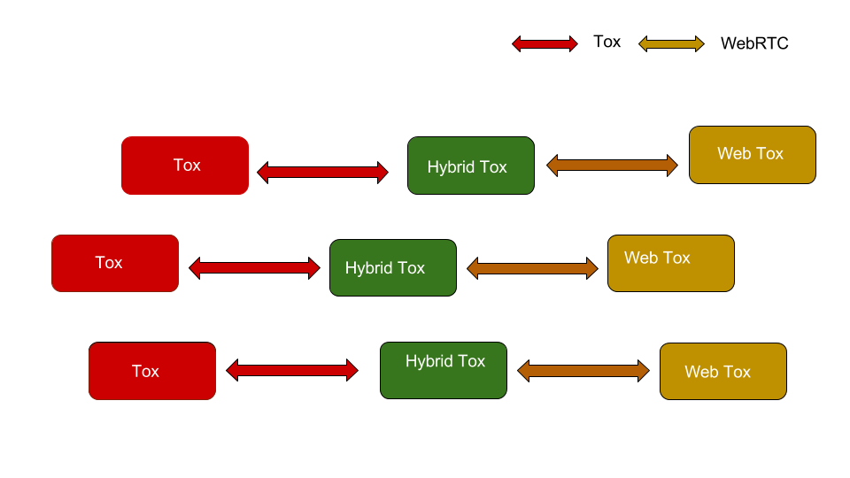

#WebTox

> Bringing Tox to the Browser. 

WebTox wants to bring Tox to the browser. Building web applications using Tox would be as simple as requiring Tox.js .

##RoadMAp

Since Browsers don't support UDP due to security reasons WebTox would be implemented with the help of WebRTC. Initially there would be only Webtox clients. They communicate with each other with the help of Webrtc. Since the normal Tox clients don't have Webrtc supprort there is no way of Webtox clients to communicate with the normal Tox clients. 

This can be fixed by making Hybrid clients. Hybrid clients which runs on server(like Node.js) supports both Webrtc and UDP. They can communicate with both Webtox clients and normal Tox clients. They can pass the messages from Tox clients to Webtox clients and vice versa. 

The hybrid clients can be eliminited once the Tox applucations add support Webtox. 
